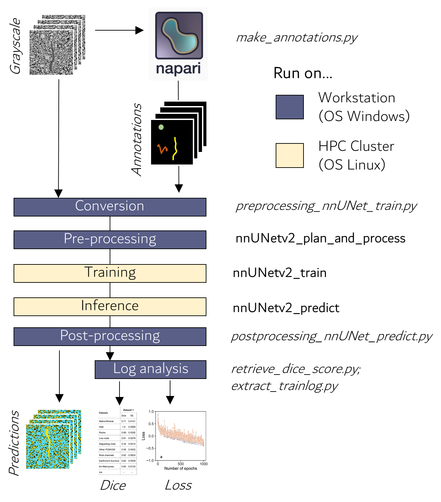

# Welcome
This repository contains the code and documentation to run the complete nnUNet pipeline on 3D X-ray CT images of soil samples. It was developed in the framework of a collaboration between the Department of Soil System Sciences of the [Helmholtz Center for Environmental Research](https://www.ufz.de/) (UFZ) and the Applied Computer Vision Lab of [Helmholtz Imaging](https://www.helmholtz-imaging.de/). The main purpose of the collaboration was to promote and ease the adoption of deep learning for image segmentation tasks in soil science, with a focus on 3D X-ray CT images. Our contribution is three-fold, i.e., we developed:  
1. A new methodology to provide an efficient labeling strategy to obtain ground-truth annotations.
2. Several scripts to prepare the input images to a format that is compatible with nnUNet.
3. Extra utilities to extract results in a format that can be diretly used for generating figures for papers. These results include data such as Dice scores or the value of the Loss function as a function of the number of epochs during training. 

In this repository, we provide detailed explanations on how to transition from a 3D image stack to nnUNet predictions. If you used this repository and associated code for your own work, please cite the following references to acknowledge our efforts: 
````
Isensee, F., Jaeger, P. F., Kohl, S. A., Petersen, J., & Maier-Hein, K. H. (2021). nnU-Net: a self-configuring method for deep learning-based biomedical image segmentation. Nature methods, 18(2), 203-211. https://doi.org/10.1038/s41592-020-01008-z
````
````
Phalempin, M., Krämer, L., Geers-Lucas, M., Isensee, F., & Schlüter, S. (2024). Advanced segmentation of soil constituents in X-ray CT images using nnUNet. Authorea Preprints. https://doi.org/10.22541/essoar.173395846.68597189/v1
````

# Philosopy
The scripts and repository were written asumming (almost) no prerequisite programming experience of the user. Together, we will go in detail into a range of technical aspects, from installing plugins to tapping into the resources of high performance computing (HPC) cluster. We aimed to write codes which are flexible and easy to use. For this, most scripts require only file paths to be adjusted by you. In many cases, these filepaths are given from the terminal (with so called "flags") so that you won´t even have to edit the scripts. In only a two occasions you will have to actually modifiy hyperparameters within a shell script. We will get to that later.

We hope that this philosophy and the level of details of this document will help many X-ray CT enthousiasts getting onto the deep learning boat. We also hope you will find this repository helpful. Feel free to contact us if you want to share your experience using nnUNet on your X-ray CT images of soil samples.

<!-- We are aware that the fluidity of the code could have been improved. On some occasions even, a few file format conversion are superfluous. On purpose, we chose to go for redundancy instead of modifying the native code of nnUNet. -->

# Nomenclature
Before getting down to business, let´s define a few terms to avoid any potential confusion. 
- Dataset: Collection of all images and annotation
- Image: one single (.tif, .mha or .nii.gz) file which contains the grayscale values
- Class: a category present in the images, e.g., for instance "roots", "soil matrix" or "biopores" 
- Label: the specific value assigned in the segmentation mask, e.g., 1 = Roots; 2= Soil matrix; 3 = Biopores
- Annotation: one single (.tif, .mha or .nii.gz) file which contains the labelled classes - Created by ythe user (you!)
- Prediction: one single (.tif, .mha or .nii.gz) file which contains the labelled classes - Created by nnUNet
- Mask: a separate image that defines which voxels belong to specific classes (or labels). Masks can be binary if only background and foregound are of intestest or grayscale for multiclass segmentation. Essentially, an annotation file is also a mask and both words can be used interchangeably in this documentation.  
- Image crops: refers to an image that was cropped from a bigger image (in terms of size). "Subvolumes" or "cutouts" are synonims of "image crops". 

# Workflow
Our workflow includes several crucial steps such as image annotation, conversion, preprocessing, model training, inference and analysis of the output data (Figure 1). The workflow was mainly developed in a Python environment. It uses several scripts (steps in italic font on figure 1) which create annotations and convert the images to nnUNet-friendly formats, before processing using the native nnUNet pipeline (steps in bold font on figure 1). 

<p align="center">
   
</p>

**Figure 1.** Workflow to transition from 3D X-ray CT image stacks to nnUNet predictions 

Our workflow relies on the use of HPC cluster to perform computionnally demanding tasks such as training and inference. We highly recommend you do the same because GPUs are so much faster than CPUs. Also, we have developed this workflow in a way that several GPUs can work in parallel on several cutouts of the same image. This feature allows increased processing speed, which makes it highly competitive, even against less computationally demanding segmentation methods. If your university or research insitution does not offer access to a HPC cluster, consider relying on dedicated GPU Servers that can be rented. For processing tasks that rely on CPUs only, we recommend using a regular workstation. To develop the workflow, we used a workstation running on Windows (64-bit, Intel(R) Xeon(R) Gold 6142 CPU and 192 GB RAM) for CPU tasks only. For GPU tasks only, we used the [EVE cluster](https://www.ufz.de/index.php?en=51499). The EVE cluster is a HPC cluster maintained by the UFZ and which hosts several NVIDIA A100. 

# 1.  Provide dataset information
The first step of our workflow is to provide some parameters and informations in the ```dataset_info.json``` file. In this file, set the TaskID as any three digit number of your choice, choose a meaningul name for your dataset and a normalization method (more on that later in the documentation, for now you can leave it as it). Set the labels according to the classes of interest that you want to segment. Finally, set a RGB code that defines how each class is displayed during the annotation of your images. Below, we show the class definition that we used for the Dataset 1 (see our [publication](https://doi.org/10.22541/essoar.173395846.68597189/v1) for more information).

````python 
{   "TaskID": 777, 
    "DatasetName": "GCEF", 
    "norm_type": "noNorm", 
    "labels": { 
        "0": "ToPredict",
        "1": "Matrix",
        "2": "Wall",
        "3": "Rocks",
        "4": "FreshRoots",
        "5": "DegradingRoots",
        "6": "otherPOM",
        "7": "RootChannels",
        "8": "EarthwormBurrows",
        "9": "otherPores"
    },
    "colors": { 
        "0": [0, 0, 0],
        "1": [115, 0, 102],
        "2": [51, 51, 51],
        "3": [255, 255, 0],
        "4": [204, 0, 0],
        "5": [255, 153, 51],
        "6": [204, 255, 255],
        "7": [11, 0, 255],
        "8": [51, 204, 0],
        "9": [0, 122, 153]
    }
}
````
It is important to note that the label "0" should always be the class "ToPredict" (i.e., not annotated). Also, the label "1" should always be set to "SoilMatrix". Once this is done, we can start preparing some ground thruth data.

# 1.  Ground truth data preparation 
# 1.1 Setting up your computer 
## 1.1.1 Install Miniforge 
Miniforge is a lightweight version of Anaconda that helps install and manage Python and other software packages efficiently. It’s designed for flexibility and supports open-source package management with Conda, making it ideal for scientific computing and data analysis. We recommend the distribution [Miniforge](https://github.com/conda-forge/miniforge#miniforge3). For ease-of-use, it is recommended to install it for your use only and to add Conda to the PATH variable during installation.

## 1.1.2. Create a virtual environment <!-- Successful on BOPHY116 -->
When working with Python, we often rely on various plugins and software libraries that need to be well-organized. One effective way to manage them is by using Conda environments. A Conda environment functions like a virtual workspace or isolated system, accessible through the terminal. Software installed within one Conda environment remains separate and may not be available in others. If an environment becomes unstable—for instance, due to incompatible software—you can simply create a new one and start fresh. Please use the following command in your Miniforge terminal to create a virtual environment.
````
mamba create -n venv-napari python=3.11
````
If you wish, replace "venv-napari" by any name if you want to give to your virtual environment. Choose a name that is meaningful and easy to remember as you are likely to be using it often.  Make sure to activate your virtual environment before proceeding with further installations:
````
mamba activate venv-napari
````
## 1.1.3. Install devbio-napari <!-- Successful on BOPHY116 -->
Napari is an open-source tool for viewing and analyzing large 2D and 3D images, commonly used in scientific research. It provides an interactive, user-friendly interface for exploring image data, making annotations, and applying analysis techniques. What we love so much about Napari is that it is scriptable which makes it really easy to work with. We recommend devbio-napari, a distribution of [Napari](https://github.com/haesleinhuepf/devbio-napari) with a set of plugins for bioimage analysis. In our workflow, we used Napari to annotate images. Please use the following command in your Miniforge terminal to install devbio-napari.
````
mamba install devbio-napari pyqt -c conda-forge
````
# 1.2. Image selection
To create representative groundthruths dataset, it is important to define classes of interests (i.e., roots, soil matrix, biopores, etc...) and to select subvolumes which contain those classes. Due to the spatial and temporal heterogeneity of constituents in soils, it is unlikely that all classes will be present within one single image. Therefore, we recommend selecting subvolumes while making sure that the classes of interests are present in the whole training datasets at least once (but they can be absent in some images). We recommend preparing image cutouts having the same x-y extent as the original but only 300 slices in the Z-direction. This allows to work with small images. Moreover, 300 slices is usually enough to capture classes of interests representatively.

IMPORTANT: The selected images for groundtruth generation should be in a 3D .tif file format.  

# 1.3. Image annotation
For image annotation, we developed a strategy that minimizes annotation efforts while still ensuring that all relevant classes are captured. This strategy relies on dense annotations of one slice and on sparse annotations for interesting classes within a stack (see figure 2 in our [publication](https://doi.org/10.22541/essoar.173395846.68597189/v1)). To perform dense annotations, the middle slice of the stack was segmented with Otsu thresholding to isolate the soil matrix and  it was heavily densely manually for other interesting classes. 

To do so in a semi-automatic manner, we created the `make_annotations.py` script. 
Once the classes are modified according to your dataset and the colors are defined for each label, you can launch the `make_annotations.py` script. This script takes three arguments, i.e., the input folder path (the path to the folder containing the images that you want to annotate), the output folder path (the path to the folder where the annotations will be saved) and the sample ID (the name of your image). These arguments are passed from the command terminal with the three flags "-i", "-o" and "-id", respectively.   
````
python make_annotations.py -i </path/to/the/images/to/annotate> -o </path/to/where/annotations/will_be/saved> -id <sample_ID>
# Example
python make_annotations.py -i C:\Users\phalempi\Desktop\images -o C:\Users\phalempi\Desktop\annotations -id SPP_P21_SPE_UC193
````
Just a few moment after launching the script, the image name and shape will be printed in the terminal. Afterwards, the GUI of Napari pops up and displays the middle slice of the loaded image. On that middle slice, the soil matrix appears in color (115,  0, 102) (RGB). To get familiar with the GUI of Napari, we recommend consulting external resources. There are some very good explanatory videos out there (for instance on YouTube) that show how to efficiently annotate images with Napari. Because a short video is more impactful than thousands words, we won´t go over the procedure in this repository. Note that with the current version of nnUNet at least five annotations are needed. In all cases, we recommend not using less than five annotations.

Once you are done annotating your images, close the Napari GUI and the annotated images will be automatically saved under the path given after the flag -o. Before going further with data preparation, make sure to deactivate the current virtual environment.
````
mamba deactivate
````
# 2. Data preparation 
# 2.1. Setting up your computer 
## 2.1.1. Create a virtual environment <!-- Successful on BOPHY116 -->
Unfortunately, devbio-napari and nnUNet can not be installed in the same virtual environment because of conflicts between version packages. This means that we need to install another virtual environment to work with nnUNet. We can create a virtual environment and activate with a single command line as follows: 
````
mamba create -n venv-nnunet python=3.11 && conda activate venv-nnunet
````
## 2.1.2. Install git <!-- Successful on BOPHY116 -->
Git is a version control system that helps track changes in code and collaborate on projects. Git can also be used to download code as it allows users to clone repositories from remote servers (e.g., GitHub, GitLab, Bitbucket). Here, we are gonna to use git to download the nnUNet repository from GitHub. To install git, type the following command in your terminal.
````
mamba install git
````
## 2.1.3. Install nnUNet <!-- Successful on BOPHY116 -->
nnUNet is a self-configuring deep learning framework for medical image segmentation. It automatically adapts to new datasets by optimizing preprocessing, network architecture, and training settings, making it a powerful and user-friendly tool for segmentation tasks. More information on nnUNet can be found [here](https://github.com/MIC-DKFZ/nnUNet/blob/master/documentation/installation_instructions.md#installation-instructions). To install nnUNet, enter the following commands: 
````
git clone https://github.com/MIC-DKFZ/nnUNet.git
cd nnUNet
pip3 install -e .
````
After installing nnUNet, create some folders named "nnUNet_raw" and "nnUNet_preprocessed". After creating the folders, set them as environmental variables using the following commands in your Miniforge
terminal: 
````
set nnUNet_raw= your/path/to/nnUNet_raw
set nnUNet_preprocessed=your/path/to/nnUNet_preprocessed
````

## 2.1.4. Download ImageJ <!-- Successful on BOPHY116 -->
ImageJ is a free, open-source image processing software widely used in scientific research. In our workflow, we used ImageJ to convert the input images to a nnUNet-friendly format. You can download ImageJ (Fiji) from [here](https://imagej.net/software/fiji/downloads#other-downloads).

## 2.1.5. Download the files from this repository and place them in appropriate folders 
1. Put the imageJ macros (files ending with .ijm) into the macros folder in the Fiji app (at .../Fiji.app/macros).
   
   **For Windows**: The files are convert_mha_to_img.ijm, convert_nii_to_mha.ijm and convert_tif_to_mha.ijm.
   
   **For Ubuntu**: convert_mha_to_img_ubuntu.ijm, convert_nii_to_mha_ubuntu.ijm.
    If the Ubuntu scripts are used, remove the _ubuntu sufices in the filenames.
3. Put the nnUNetTrainer_betterIgnoreSampling.py into nnunet/nnunetv2/training/nnUNetTrainer/variants/sampling/
4. Place nifti_io.jar into the plugins folder of ImageJ (at ../Fiji.app/plugins").
   
## 2.1.6. Setting file paths
Open the \_\_path__.py file (from this repository) with a Text Editor and adapt the paths according to your local installations. You have to define the four following paths: 
1) the path to your ImageJ application
2) the path to the nnUNet_raw folder (same as you set as an environment variable during the nnUNet installation)
3) the path to the images of your training data (input_dir_images) # IMPORTANT: images should be in 3D stack .tif format
4) the path to your annotations (input_dir_masks) # IMPORTANT: annotations should already be in 3D stack .tif format if you used `make_annotations.py` to generate the annotations

# 2.2. Data conversion
This step takes the image and annotation files from two given folders, processes them and saves them as .nii.gz in the nnUNet_raw folder. Here, you have to keep in mind that our workflow was developed so as to work in a "folder-based" manner. This means that all images should be in one folder and all annotations should be in another one. Data conversion entails converting the input files to .nii.gz, handling the ignore label in the annotations, cropping image and annotation to the relevant parts, normalizing the image crops and putting everything into the nnUNet format (adhering to nnUNets naming conventions of folders and files and creating a dataset.json).  During this step, data will be normalized according to four different possibles methods:

- *noNorm*: No normalization is done
- *zscore*: normalize by mean and std: ```(img - mean_) / std_``` (this is the nnUNet default method)
- *rescale_to_0_1*: rescale the values to the range of 0 and 1: ```(img-min_)/(max_-min_)```
- *rgb_to_0_1*: Just divide by 255: ```img/255```

You can set the appropriate method in the ```dataset_info.json``` file. Once this is done, start converting your data by running:
````shell
python preprocessing_nnUNet_train.py
````
<!-- Notes for me: This step takes roughly 7 minutes for an image of 3G on BOPHY116 --> 

# 2.3. Preprocessing and planing
The preprocessing and experiment planing are default steps in the native nnUNet pipeline. These steps use the data from nnUNet_raw, processes them and saves them in the nnUNet_preprocessed folder. Depending on your data this can take a while and consume a lot of RAM. You can run the preprocessing with the following command.

```shell
nnUNetv2_plan_and_preprocess -d <TaskID> -c 3d_fullres -np <num.processes> -npfp <num.processes>
# Example
nnUNetv2_plan_and_preprocess -d 777 -c 3d_fullres -np 4 -npfp 4
```
The TaskID parameter has to be the one you defined in the previous step. The -np and -npfp parameters define how many processes are used during the preprocessing.  A higher number means the preprocessing is faster but more RAM is consumed and with lower numbers less RAM is needed but the processing will take longer. You can play around with this parameter, for us 4 worked well. Now that your data abides to the nnUNet format and are preprocessed, the training process can start.

# 3. High Performance Computer cluster
# 3.1 Introduction
Before we get into the training procedure, let´s briefly describe what are HPC Clusters to put everyone on the same level. An HPC cluster is a system made up of multiple interconnected computers (often called nodes) that work together to perform complex computations. These clusters are designed to handle tasks that require a large amount of computational power, such as scientific simulations, data analysis, machine learning, or rendering. Most HPC clusters run on Linux due to its stability, scalability, and open-source nature. HPC clusters typically use a job scheduler (like SLURM) to allocate resources and manage the execution of computational tasks across the nodes. For the rest of this example, we will assume that you also dispose of a cluster running on Linux with a SLURM job scheduler (this is actually the case for many of the HPC out there...).

# 3.2. Connecting to your HPC Cluster
How you connect to your HPC Cluster is mostly gonna dependent on the infrastructure and software available in your university or research institution. At the UFZ, we have prefered to use softwares with GUIs, althought we are aware that SSH connection is usually more convenient. For this, we have used FileZilla to transfer local files (i.e., the files on your workstation) to remote locations (i.e., folders on the HPC). We have also used X2GO client to connect to the head node of the cluster and send jobs across the cluster. We recommend that you contact your IT administrator to figure out what is the easiest solution for you. In the following, we will assume that got these steps right and that you could successfully connect to your HPC Cluster.

## 3.3. Storing data on your cluster
There are several locations on which data can be stored on a HPC cluster. The appropriate location will depend on the filetype and their expected lifetime. It is good practice to keep all softwares, virtual environments, scripts and git repositories on the /home folder. The /work folder is suited to store the output of jobs and it has therefore a high disk quota, however the file lifetime can be limited. To store data which should be kept for longer period of times (i.e., trained models or grayscale data), the /data directory is approriate. 

Note that not all HPC clusters have exactly the same directory structure and nomenclature, but many follow a similar convention like the aforementionned one. Here again, contact your IT administrator to find out the best data storage options for your data. 

# 3.4. Requesting resources from your HPC Cluster
Please consider the following when requesting resources on your cluster. One of the most important resource at EVE is the maximum runtime of jobs. It specifies a limit which a running job may not exceed. If the job exceeds the requested time, it will be killed automatically by the scheduler. The same applies for the requested memory per cpu. It is a good practice to optimize these parameters to avoid exceeding the job requirements, but to keep them as low as possible so that the scheduler grants resources quicker. 

<!-- FOR UFZ Users: Note also that GPU Nodes only have a maximum of 470GB RAM available. This means that the total amount of RAM (calculated as cpus-per-task * mem-per-cpu) has to be inferior to 470GB -->  

# 3.5. Setting up your HPC Cluster
## 3.5.1. Setting  up a virtual environment
Because we are now physically using another computer (the cluster), we have to create (again) a new virtual environment for nnUNet. Since the cluster runs on Linux OS, the commmands to create virtual environment slightly differ. Here is an example:

````shell
python -m venv /home/username/venv-nnunet
````
where "username" is your login name and "venv-nnunet" is the name of your virtual environment. Here we used venv-nnunet to be consistent with the previous naming.

Then activate the virtual environment with the following command: 
````shell
source /home/username/venv/bin/activate
````

## 3.5.2. Install PyTorch
Once your virtual environment is created, you can now install PyTorch. PyTorch is an open-source machine learning library for Python, widely used for deep learning and artificial intelligence. It provides flexible tools for building, training, and deploying neural networks, with strong support for GPUs and dynamic computation graphs. To install PyTorch, enter the following command: 
````
pip3 install torch torchvision torchaudio --index-url https://download.pytorch.org/whl/cu117
````
Note that, here, we install an older PyTorch version (compatible with the CUDA platform 11.7). More recent versions of CUDA are currently available, however we have not yet tried them.

## 3.5.3. Install nnUNet
To install nnUNet, please repeat the operation described at the section 2.1.3. 

## 3.5.4. Moving your files to the HPC cluster
Once nnUNet is installed, you can move the nnUNet_preprocessed folder can be moved to a directory of your choice of your cluster. 

# 4. Training
This step trains nnUNet with the data from nnUNet_preprocessed and saves the models, logs and checkpoints in the folder "nnUNet_results". The content of nnUNet_preprocessed is used during training. If preprocessing and training are done on different devices you have to sync the nnUNet_preprocessed folder to the device on which you want to train. nnUNet is trained using 5-fold cross-validation. This means you have to run a separate training for each fold and each fold creates a classifier file (the checkpoints_best.pth file which contains the weights of the model). 

To run the training on the cluster, open the file `submit_nnunet_training.sh` with a text editor (e.g., gedit):

````shell
gedit submit_nnunet_training.sh 
````
In the shell file, modify the parameters related to your job submission. These parameters are the ones given after the command #SBATCH in the code below. It is hard for us to give recommendations here as parameters such as memory, time and GPU is dependent on your input image size and cluster specs. The values given might be good start, but you might need to tweek some to optimize your resource request.

````shell
#!/bin/bash

#SBATCH --job-name=nnunet_training     # jobname
#SBATCH --chdir=/work/username         # set the working directory 
#SBATCH --output=/work/%u/%x-%A-%a.log # give name and filepath for the .log file (console output)
#SBATCH --time=1080                    # time requested for each training job (in minutes)
#SBATCH --nodes=1                      # number of nodes requested
#SBATCH --ntasks=1                     # number of tasks across all nodes
#SBATCH --cpus-per-task=7              # number of cpus per tasks (>1 for multithreading). 
#SBATCH --mem-per-cpu=60G              # memory allocated per CPU. 
#SBATCH --mail-type=BEGIN,END          # request notifications upon starting and ending the job
#SBATCH -G nvidia-a100:1               # request specifically a NVIDIA A100 

###  activating  the virtual environment
source /home/username/venv-nnunet/bin/activate 
## declaring the environment variable
export nnUNet_preprocessed="/data/bosys-nnunet/nnUNet_preprocessed" 
export nnUNet_results="/work/phalempi/nnUNet_results" 

## run nnUNet training command (see section 2.3)
nnUNetv2_train 777 3d_fullres $SLURM_ARRAY_TASK_ID -tr nnUNetTrainer_betterIgnoreSampling
````
Once you are done adjusting #SBATCH parameters and filepaths, submit the shell script as an array job using the following command. 

````shell
sbatch -a 0-4 submit_nnunet_training.sh 
````
Depending on the resources currently available, SLURM will distribute each training fold (fold 0, 1, 2, 3 and 4) to a node hosting a GPU, so that all the five training folds will run simultaneously. The results of the training procedure will be written in the nnUNet_results folder. When the five training folds are completed we can use the model to make predictions.

# 5. Inference
## 5.1. Preprocessing of the images to be predicted 
This step aims to preprocess the images that you want to run the predictions on (i.e., the ones that were not selected as part of the training dataset). This preprocessing mainly entails an image normalization and a conversion from a 3D .tif stack to a format nnUNet can read, i.e., .nii.gz. To convert the images with the following command: 

When images to predict are in 3D .tif format, please use: 
````shell
python preprocessing_nnUNet_predict_tif.py -i /path/to/images_tif -o /path/to/images_nii
````
When images to predict are in 3D .mha format, please use: 
````shell
python preprocessing_nnUNet_predict.py -i /path/to/images_mha -o /path/to/images_nii
````
## 5.2. Splitting the images
We highly recommend to split the images after conversion to .nii.gz. This splitting basically isolate smaller cutouts in the z-direction of the original image. The benefits of splitting the images are two-folds: 
1) It divides the images into smaller parts, so as to make sure that they are small enough to fit onto the GPU VRAM.
2) It allows to spread the predictions more efficiently across the GPU nodes of the cluster with array jobs. 

To split the data, use the following command:
````shell
python preprocessing_nnUNet_predict_split.py -i /input/path/to/images_nii/to_split -o /output/path/for/split/images -s 8 -m /path/to/the/trained/model
````
Here there are several things to note: 
1) The model (given after the flag -m) is located at: \nnUNet_results\Dataset<TaskID>_<DatasetName>\nnUNetTrainer_betterIgnoreSampling__nnUNetPlans__3d_fullres. The command actually works without giving the model path, but default values are taken then. Since the nnUNet_results folder is on the cluster, you might want to either run `preprocessing_nnUNet_predict_split.py` from the terminal of the cluster or transfer back the nnUNet_results folder to your workstation in order to do the splitting there. The reason why we give the model here is that patch size and spacing are read from the plans.json file located in the model folder. The patch size and image spacing are used to calculate the overlap that will be used during splitting the images. Choosing an appropriate overlap is necessary to avoid segmentation artifacts between image splits. 

2) The number of splits (given after the flag -s) has to be set by you. The appropriate value will depend on the VRAM of the GPU that you use. So far, we have had good results working with splits with values between 8 and 10, which means that the resulting image size would usually be inferior to 500 MB. 

Once the data is split, upload to a folder of your choice (/path/to/input/images) on the cluster. 

<!-- NOTES: for Dataset444: patch_size was 48, 224, 224; spacing: 1,1,1 -->
<!-- NOTES: for Dataset777: patch_size was 48, 224, 224; spacing: 1,1,1 -->
<!-- NOTES: I might have lost the classifier for Dataset304; run again? -->

## 5.3. Run the predictions
### 5.3.1 Preparing of array jobs for the predictions
In order to run the predictions in a parallelized fashion on your cluster, each image has to be placed in its specific folder. The reason is that nnUNet predicts all the images present in a given folder. By putting one image in a single folder, the memory and time requirements are low and the images can be distributed across all nodes hosting GPUs. To spare you the effort of moving each image into an individual folders, we created a shell script ```mkdir_movefiles.sh`` that does the job for you. The shell script takes two arguments: (1) the input folder containing the images to be predicted and (2) the directory path where the folders will each individual folders will be created. Those arguments are given after the flags -i and -o, respectively. You can then run the shell script with the following command. 

````shell
sh mkdir_movefiles.sh -i /path/to/input/images -o /path/to/output/images
````
Note that if "/path/to/output/image" does not exist, it will be created automatically. Note also that here, we do not need to submit the job to the scheduler but can simply run it with a "sh" command. After running this shell script, all images are now placed into a single individual folder and are ready to be processed.

### 5.3.2 Running predictions with an array job
In order to run the predictions in parallel, we have to create a so-called "array job". Job arrays allow to use SLURM's ability to create multiple jobs from one script. For example, instead of having 5 submission scripts to run the same job step with different arguments, we can have one script to run the 5 job steps at once. This allows to leverage the cluster´s ability to process images simulateneously (x GPUs process x images at the same time). To do so, modify the shell script ``submit_nnUNet_inference `` according to your resource and file paths. 

````shell
#!/bin/bash

#SBATCH --job-name=nnunet_prediction
#SBATCH --chdir=/work/username
#SBATCH --output=/work/%u/%x-%A-%a.log
#SBATCH --time=45
#SBATCH --mem-per-cpu=60G
#SBATCH --mail-type=BEGIN,END
#SBATCH -G nvidia-a100:1

##  activating  the virtual environment
source  /home/username/venv/bin/activate 
## declaring the environment variable
export nnUNet_results="/path/to/nnUNet_results"

# Define the folder path
folder_path_in="/path/to/your/grayscale_data"    # modify according to your path
folder_path_out="path/to/save/your/predictions"  # modify according to your path

# Initialize an empty list
file_list=()

# Loop through all files in the folder and add them to the list
for file in "$folder_path_in"/*; do
    # Check if it's a file (not a directory)
    if [ -d "$file" ]; then
        file_list+=("$(basename "$file")")
    fi
done

## Run inference with nnUNet native command
nnUNetv2_predict -i "$folder_path_in"/"${file_list[$SLURM_ARRAY_TASK_ID]}" -o "$folder_path_out" -d 777 -tr nnUNetTrainer_betterIgnoreSampling -c 3d_fullres
````
To submit the array job, use the following command:

````shell
sbatch –a 0-n submit_nnUnet_array_list.sh  
````
where the parameters "0" and "n" correspond to indices used to retrieve the sample´s name in file_list[]. Practically, "0" is fixed and "n" is the total number of images to predict. The value of "n" has to be modified according to your dataset, i.e., if you have, say 12 images in "/path/to/your/grayscale_data", set n=11 (we start counting from 0!). Depending on the resources available, the SLURM system will distribute each image to a GPU for prediction. To check the status of your submitted jobs, you can enter the following command in your terminal.

````shell
sacct
````
## 5.4. Post-processing of the predictions 
### 5.4.1 Ensemble the splitted Images 

Needs only be done if images got split in Step 2.

````shell
python postprocessing_nnUNet_predict_ensemble.py -i <input.path.to.splitted.prediction> -o <output.path.for.ensembled.predictoin>
# Example
python postprocessing_nnUNet_predict_ensemble.py -i /media/l727r/data/UFZ_CTPoreRootSegmentation/HI_dataset2_grass_vs_crop/test_splitting/splitted_prediction -o /media/l727r/data/UFZ_CTPoreRootSegmentation/HI_dataset2_grass_vs_crop/test_splitting/prediction
````

### 5.4.2 Final file conversion
Just transfer the .nii.gz files into the .mha format.
````shell
python postprocessing_nnUNet_predict.py -i <input.path.to.nii.gz.predictions> -o <output.path.to.mha.predictions>
# Example
python postprocessing_nnUNet_predict.py -i /home/l727r/Desktop/UFZ_2022_CTPoreRootSegmentation/predictions_nii -o /home/l727r/Desktop/UFZ_2022_CTPoreRootSegmentation/predictions_mha
````
# 6. Log analysis


# Comments
- **Runtime reduction:** There is some tradeoff between runtime and performance, the current setup aims for getting the best result. 
If you want to reduce the runtime, there are different ways to archive this, but with the downside of loosing some performance.
Again, just let us know if you want same changes here.

- **Format of input images:** There is the possibility to start with grayscale images in .mha format. 
- **Checkpoints during training:** Note that during training, checkpoints are automatically created after 50 epochs. If for whatever reasons a training fold killed by your scheduler, you can resume training from a previously created checkpoint. Therefore, the following command can be used.

````shell
nnUNetv2_train <TaskID> 3d_fullres <fold> -tr nnUNetTrainer_betterIgnoreSampling --c
````
# Contribution

This repository was drafted by Maxime Phalempin (UFZ) and Lars Krämer (DKFZ, HIP). It was reviewed and edited by Steffen Schlüter (UFZ), Maik Geers-Lucas (TUBerlin) and Fabian Isensee (DKFZ, HIP). 

# Acknowledgements
Part of this work was funded by Helmholtz Imaging (HI), a platform of the Helmholtz Incubator. 

<p align="left">
   
   
</p>
